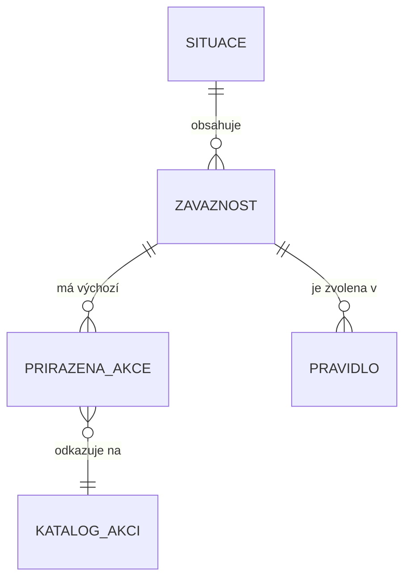

# Specifikace pro vývoj: Situace a akce, Pravidla pro tracking

**Datum:** 2026-07-24
**Určeno pro:** vývojový tým, který staví produkční verzi na základě tohoto dokumentu a interaktivního prototypu.

---

## 1. Proč tahle konfigurace vzniká

Appka řeší dvě věci, které spolu úzce souvisí, ale je dobré je od začátku vnímat odděleně:

- **Bez konfigurovatelných pravidel** by každou novou situaci, na kterou má appka upozornit operátora (zásilka se nedoručila, uvízla na cestě, poškodila se…), musel naprogramovat vývojář zvlášť. Cílem **Pravidel pro tracking** je dát uživateli appky (ne vývojáři) nástroj, kterým si sám poskládá, za jakých podmínek nad tracking daty zásilky se má na problém upozornit — bez zásahu do kódu.
- **Bez sdílené vrstvy Situace/Závažnost/Akce** by ale každé takhle poskládané pravidlo muselo samo od nuly určit i to, *co přesně operátor uvidí* a *co má udělat* — a dvě různá pravidla řešící v zásadě stejný problém (např. „zásilka se nedoručila napoprvé" vs. „nedoručila se ani na třetí pokus") by mohla operátorovi ukázat nekonzultní, nesourodý text a jiné kroky, i když jde o tutéž byznysovou kategorii problému. Cílem **Situace a akce** je tohle oddělit: pravidlo řeší jen *kdy*, sdílená šablona (Situace → Závažnost) řeší *co to znamená* a *co se s tím udělá* — a garantuje, že operátor dostane konzistentní zkušenost bez ohledu na to, které konkrétní pravidlo problém odhalilo.

Tenhle dokument popisuje obě části a jejich propojení:

1. **Situace a akce** — katalog šablon, podle kterých se pravidla klasifikují a podle kterých operátor ví, co má u konkrétního problému udělat.
2. **Pravidla pro tracking** — průvodce (wizard), kterým se skládají pravidla reagující na tracking záznamy zásilek, a přehledový seznam pravidel.

### 1.1 Jak číst tento dokument

Spolu s tímto dokumentem dostáváte k dispozici **klikací prototyp** — používejte ho jako vizuální a interaktivní referenci pro rozložení obrazovek, barvy a chování při kliku. Tento text je ale **závazný zdroj pravdy pro logiku**: na několika málo místech (vždy explicitně označených poznámkou „⚠ Poznámka k prototypu") popisuje o krok dál, než kam se prototyp v aktuálním buildu dostal — v takovém případě platí tento dokument, ne to, co prototyp v tu chvíli reálně dělá.

### 1.2 Co dokument NEPOKRÝVÁ

Appka má i další části, které **záměrně nejsou předmětem tohoto zadání**:

- **Soulad s trasou** (v navigaci prototypu položka „Soulad s trasou", interně také „Kontrola na bodu") — trasy, úseky a kontrolní body zásilky. Řeší se samostatně, klient ji zatím testuje odděleně.
- **Ostatní tři oblasti pravidel** — „Vyhodnocení objednávky", „Nevyzvednutá objednávka", „Parametry a cena". V appce jsou vidět jen jako neaktivní položky s poznámkou „brzy" — zatím pro ně neexistuje žádná konfigurace ani datový model, nejsou předmětem tohoto zadání.
- Runtime vyhodnocovací engine, který by pravidla skutečně spouštěl nad reálnými tracking daty a generoval věci k řešení (VkŘ) pro operátora. Tento dokument popisuje **konfiguraci** pravidel (co si uživatel appky nastaví), ne implementaci enginu, který podle toho za běhu vyhodnocuje zásilky.
- Cokoliv okolo samotné věci k řešení (VkŘ) jako runtime objektu — jak vypadá na obrazovce operátora, notifikace, označení vyřešeno apod. To je budoucí práce, tady se řeší jen **konfigurace toho, co by taková VkŘ měla obsahovat**.

---

## 2. Slovník pojmů

| Pojem | Význam |
|---|---|
| **Situace** | Byznysová kategorie problému, např. „Nedoručeno" nebo „Poškození zásilky". Slouží čistě ke klasifikaci a jako kontejner pro Závažnosti — sama o sobě nic nekonfiguruje. |
| **Závažnost** | Stupeň uvnitř Situace, např. „kritické". Nese výchozí prioritu a seznam přiřazených Akcí — je to šablona, kterou si Pravidlo při založení převezme. |
| **Akce** (přiřazená k závažnosti) | Jeden konkrétní krok, který má operátor udělat (např. „Zavolat zákazníkovi"), doplněný volitelným výchozím textem popisujícím, co přesně má udělat. |
| **Katalog akcí** | Sdílený, appkou-wide seznam štítků akcí (např. „Zavolat zákazníkovi", „Informovat e-mailem"). Přiřazená akce u Závažnosti na tento katalog jen odkazuje. |
| **Pravidlo** | Konkrétní konfigurace: kdy se má spustit (Spouštěč), za jakých podmínek (Podmínky) a co se má stát (Akce, převzaté ze Závažnosti). Patří vždy do jedné Oblasti — v rozsahu tohoto dokumentu vždy do oblasti „Záznamy z trackingu". |
| **Spouštěč** | Mechanismus spuštění Pravidla — buď **Automaticky** (reaktivně, při každém novém tracking záznamu), nebo **Časovač** (periodická kontrola). |
| **Podmínka** | Jedna dílčí testovatelná věc, kterou musí zásilka/záznam splňovat, aby se Pravidlo spustilo. Podmínky v rámci jednoho bloku se vždy kombinují logickým **AND** (musí platit všechny najednou). |
| **VkŘ (věc k řešení)** | Runtime instance pro operátora, která vznikne, když se Pravidlo spustí a jeho podmínky jsou splněné. Mimo rozsah tohoto dokumentu — řeší se jen její konfigurace. |
| **Priorita** | Čtyřstupňová škála `LOW / MEDIUM / HIGH / URGENT`, existuje na Závažnosti (výchozí) i na Pravidle (vlastní, editovatelná kopie). |

---

## 3. Mentální model — jak spolu Situace, Závažnost, Akce a Pravidlo souvisí



Klíčová myšlenka: **Situace a Závažnost nikdy nic samy nespouští ani nekonfigurují.** Jsou to jen štítky s výchozím obsahem. Veškerou logiku „kdy se má co stát" nese výhradně **Pravidlo**:

- Pravidlo si při založení vybere přesně **jednu** Závažnost (a tím i její Situaci) — to určuje, do jaké kategorie problém patří a jaké akce se s ním pojí.
- Pravidlo si nezávisle na tom nastavuje vlastní **Spouštěč** a **Podmínky** — dvě různá pravidla mohou mířit na stejnou Závažnost, ale mít úplně jiné podmínky spuštění (typický příklad ze seed dat: „Nedoručeno" má tři pravidla — jedno na 1., druhé na 2. a třetí na 3.+ neúspěšný pokus — každé se svou vlastní podmínkou počtu pokusů, všechna na jinou Závažnost stejné Situace).
- Jakmile je Pravidlo jednou uložené, volba Situace/Závažnosti se **už nedá změnit** — pokud má později patřit jinam, založí se nové Pravidlo. Název, popis a priorita Pravidla naopak zůstávají volně editovatelné kdykoliv.

**Proč je to takhle rozdělené:** kdyby Situace/Závažnost sama nesla i časování nebo podmínky (varianta, která byla vědomě zvážena a zamítnuta), ušetřilo by to pár kliků při zakládání typického pravidla, ale platilo by se za to ztrátou flexibility — každé pravidlo je jinak specifické (jiný počet pokusů, jiná lokace, jiný práh) a nutit je do jedné pevné konfigurace na úrovni Situace by uživatele appky brzy limitovalo. Tím, že Situace/Závažnost zůstává **čistě klasifikace**, funguje stejně bez ohledu na to, kolik různě podmíněných pravidel na ni bude nakonec mířit — a stejný princip (situace jako sdílená, ale sama nekonfigurující klasifikační vrstva) se dá použít i pro budoucí zdroje věcí k řešení mimo tracking, ne jen pro tenhle wizard.

> ⚠ **Poznámka k prototypu:** v aktuálním buildu prototypu jde výběr Situace/Závažnosti přepnout i při editaci existujícího Pravidla — selecty a tlačítka nejsou nijak uzamčené. To je z hlediska cílového chování mezera, ne záměr: po založení Pravidla má být tahle volba needitovatelná, přesně podle principu výše.

---

## 4. Situace a akce — katalog

Tahle kapitola je vlastní **správa šablon** popsaných v kapitole 3 — obrazovky, kde si business (ne vývojář) definuje, jaké byznysové problémy appka rozeznává a co se má s každým udělat.

**Proč je Situace samostatná entita s vlastní správou, a ne jen textový štítek napsaný přímo na Pravidle:** kromě konzistence pro operátora (viz kapitola 1) je Situace navržená jako místo, které bude v budoucnu nést i další chování nezávislé na konkrétních pravidlech — typicky až appka dostane klientský portál, půjde přesně na úrovni Situace nastavit, o jakých kategoriích problémů chce klient dostávat notifikace, a firma bude moct řídit, jaké notifikace vůbec nabízí. Tahle budoucí funkčnost není součástí tohoto zadání a nic z ní se teď nestaví — je to jen důvod, proč Situace existuje jako plnohodnotná entita se svou správou, ne jako plochý text napsaný na Pravidle.

### 4.1 Datový model

| Entita | Pole | Popis |
|---|---|---|
| **Situace** | `název`, `popis` (volitelný) | Byznysová kategorie. Vždy patří do jedné Oblasti — pro tento dokument vždy „Záznamy z trackingu". |
| | `seznam Závažností` | 1:N, uspořádaný seznam. |
| **Závažnost** | `název` | Např. „kritické", „problémové", „běžné". |
| | `priorita` | `LOW / MEDIUM / HIGH / URGENT` — výchozí hodnota, kterou Pravidlo při výběru převezme. |
| | `seznam přiřazených akcí` | 1:N. |
| **Přiřazená akce** | `odkaz na Akci z katalogu` | Které konkrétní akci (štítku) tahle položka odpovídá. |
| | `výchozí text pro operátora` (volitelný) | Volný text — co přesně má operátor v rámci téhle akce udělat. |
| **Akce (katalog)** | `label`, `ikona` | Jednoduchý sdílený štítek, žádné vlastní chování/automatizace — v tomto rozsahu je to čistě popisný tag. |

Katalog akcí je **sdílený napříč všemi Situacemi a Závažnostmi** — jedna položka (např. „Prověřit u dopravce") se dá přiřadit k libovolnému počtu Závažností současně, a při úpravě jejího labelu/ikony se tahle změna projeví všude, kde se používá.

### 4.2 Obrazovka „Situace a závažnosti" (seznam)

Vstupní bod: položka **„Situace a závažnosti"** v hlavní navigaci (dostupná odkudkoliv, ne jen jako podřízený odkaz z Pravidel).

- **Vyhledávání** — jeden textový vstup, filtruje živě (bez potvrzení) podle názvu Situace **i** podle názvu kterékoliv její Závažnosti (case-insensitive). Žádné další filtry (podle Oblasti apod.) nejsou potřeba — v tomto rozsahu existuje jen jedna relevantní oblast.
  - Prázdný výsledek má dva různé texty: „Zatím žádné situace." (opravdu žádná Situace neexistuje) vs. „Žádná situace neodpovídá hledání." (existují, ale filtr nic nenašel) — rozlišujte tyhle dva stavy.
- **Řádek každé Situace je rozbalovací.** Sbaleně ukazuje jen název, volitelný popis, počet Závažností a **celkový počet Pravidel** napojených na kteroukoliv její Závažnost (skloňování: 1 → „pravidlo", 2–4 → „pravidla", 5+ → „pravidel").
  - Po rozbalení: seznam Závažností, u každé její priorita (badge) a počet napojených Pravidel. Pod každou Závažností jsou **rozepsaná** samotná napojená Pravidla jako klikací karty — kód, název, badge Spouštěče, badge priority, tečka aktivní/neaktivní (zelená/šedá). Klik vede rovnou do editace daného Pravidla.
  - Situace bez Závažností: „Zatím žádné závažnosti." (kurzívou).
- **Tlačítko „+ Nová situace"** — vytvoří prázdnou Situaci (výchozí název „Nová situace", náhodný kód, žádné Závažnosti) a rovnou otevře její detail k doplnění.
- **Mazání Situace** je na řádku přímo v seznamu (ikona koše). **Blokované, pokud má Situace jakoukoliv Závažnost použitou v alespoň jednom Pravidle** — tlačítko je neaktivní, s popiskem „Používá se v N pravidlech". Tohle je tvrdý guard, ne jen varování — smazání musí být z UI úrovně nemožné, dokud se nezmenší počet na 0.

### 4.3 Detail Situace a editace Závažností

- Název a popis Situace se editují přímo na stránce a **ukládají se okamžitě při každé změně** — žádné tlačítko „Uložit". Tohle je záměrný rozdíl oproti Pravidlu (viz 5.6), kde se ukládá až explicitním kliknutím — obě chování jsou správná, každé pro jinou obrazovku, nezaměňovat je.
- Tlačítko „Smazat" u Situace v detailu má stejný guard jako v seznamu (blokované při jakémkoliv použití kterékoli Závažnosti v Pravidle).
- **Každá Závažnost je vlastní karta** s:
  - editovatelným názvem (auto-save),
  - selectem priority `LOW / MEDIUM / HIGH / URGENT`,
  - **mazáním blokovaným per-Závažnost** — guard počítá jen Pravidla napojená na tuhle konkrétní Závažnost (ne na celou Situaci), tzn. i uvnitř jedné Situace může jít smazat jedna Závažnost a druhá ne,
  - seznamem přiřazených akcí — každá jako štítek (label z katalogu) + textarea s výchozím textem pro operátora + odkaz „Odebrat" (bez guardu — odebrání akce ze Závažnosti nic neblokuje, i kdyby Závažnost měla napojená Pravidla, viz 4.5),
  - komponentou pro přidání další akce (viz 4.4),
  - patičkou s počtem napojených Pravidel a tlačítkem **„+ Pravidlo pro tuto závažnost"**, které založí nové Pravidlo rovnou s předvyplněnou touhle Situací/Závažností (druhý vstupní bod do wizardu Pravidel, vedle „+ Nové pravidlo" v seznamu Pravidel).
- **Tlačítko „+ Přidat závažnost"** na konci seznamu — nová Závažnost se výchozím názvem „Nová závažnost", prioritou `MEDIUM` a bez akcí.

### 4.4 Přidávání akcí — otevřený, rozšiřitelný katalog

Komponenta pro přidání akce k Závažnosti je zároveň **vyhledávač i tvůrce** nové položky katalogu — chová se jako štítky v nástrojích typu Linear/Notion:

- Textový vstup filtruje existující katalog akcí (case-insensitive, podle labelu). Akce, které Závažnost už má přiřazené, se v nabídce nezobrazují (nejde přidat dvakrát stejnou).
- Nic nenalezeno → text „Nic nenalezeno".
- Pokud zadaný text přesně (case-insensitive) neodpovídá žádné existující položce katalogu, nabídne se možnost **„Vytvořit „{text}""** — jejím vybráním vznikne nová položka v katalogu (jen s labelem, bez ikony) a rovnou se přiřadí k dané Závažnosti. Katalog akcí tedy **není uzavřený číselník editovatelný jen na jednom místě** — rozšiřuje se přímo z místa použití.

### 4.5 Napojení na Pravidlo a needitovatelnost akcí

Tohle je nejdůležitější mechanismus celé kapitoly — jak se šablona ze Závažnosti promítá do konkrétního Pravidla.

**Proč jsou Akce needitovatelné, zatímco název/popis/priorita Pravidla ne:** akce, které operátor u konkrétní věci k řešení uvidí, mají být vždy přesně ty, co jsou v tu chvíli definované na Závažnosti — bez rizika, že se jednotlivé Pravidlo v čase nepozorovaně „rozejde" se svou šablonou (např. že si někdo u jednoho konkrétního pravidla akci omylem odškrtne a nikdo si toho nevšimne, zatímco všechna ostatní pravidla stejné závažnosti ji dál mají). Název, popis a priorita se naopak liší pravidlo od pravidla přirozeně (různá pravidla stejné závažnosti typicky popisují jinou konkrétní okolnost), takže tam nezávislá editovatelnost dává smysl a needitovatelnost by naopak škodila.

Mechanismus konkrétně:

1. Ve wizardu Pravidla (viz kapitola 5) uživatel vybere Situaci, pak Závažnost.
2. Výběrem se **předvyplní priorita Pravidla** hodnotou z Závažnosti. Uživatel ji dál smí libovolně přepsat — je to jen výchozí návrh, ne vynucená hodnota.
3. **Název a popis Pravidla se nepředvyplňují vůbec** — Závažnost tahle pole nemá, uživatel je vyplňuje sám od nuly. Název je povinný (bez něj nejde Pravidlo uložit), popis je volitelný.
4. **Sloupec Akce v pravé části wizardu je čistě needitovatelný výpis** — vždy přesně odpovídá aktuálnímu obsahu vybrané Závažnosti:
   - žádný checkbox na zapnutí/vypnutí jednotlivé akce,
   - žádné mazání jednotlivé akce z Pravidla,
   - žádné „+ Přidat akci" ve wizardu Pravidla — přidávání/odebírání akcí jde jen na úrovni Závažnosti v „Situace a závažnosti",
   - výchozí text akce se zobrazuje jako obyčejný statický text, ne jako needitovatelné textové pole (nemá to působit jako dočasně vypnuté, ale jako čisté zobrazení hodnoty).
   - Pokud vybraná Závažnost nemá žádné přiřazené akce, zobrazí se prázdný stav s textem „Tato závažnost nemá žádné výchozí akce."
5. Je to **živý odkaz, ne snapshot** — pokud se akce Závažnosti později v „Situace a závažnosti" upraví (přidá se nová, smaže existující, změní se text), promítne se to **okamžitě do všech Pravidel**, která na tuhle Závažnost odkazují, aniž by bylo nutné Pravidla znovu otevírat nebo ukládat. Příklad: pokud u Závažnosti „kritické" v Situaci „Nedoručeno" přidáte novou akci „Nabídnout náhradní termín", objeví se okamžitě u všech Pravidel navázaných na „kritické" — v jejich detailu i při dalším otevření editace.
6. Odebrání jednotlivé akce ze Závažnosti **nemá guard** (na rozdíl od mazání celé Závažnosti, viz 4.3) — je to přímý důsledek principu živého odkazu, projeví se ihned všude.

> ⚠ **Poznámka k prototypu:** v aktuálním buildu je sloupec Akce ve wizardu ještě plně editovatelný (checkboxy, mazání, přidávání, needitovatelný text jako textarea) — needitovatelnost popsaná výše je cílové chování k naprogramování, prototyp ji zatím nezobrazuje.

---

## 5. Pravidla pro tracking

Wizard pro tvorbu a editaci Pravidel v oblasti „Záznamy z trackingu" — jediná oblast, pro kterou je v rozsahu tohoto dokumentu plná konfigurace.

**Proč to je flexibilní wizard, a ne hardcoded sada situací:** appka bude věci k řešení generovat i z jiných zdrojů (typicky ze Soulad s trasou, kde jsou kontrolní body a jejich vyhodnocení dané pevnou strukturou trasy — mimo rozsah tohoto dokumentu, viz kapitola 1). Tracking data jsou ale příliš rozmanitá na to, aby šla predikovat dopředu do pevné sady kontrol — jaké kombinace statusu, lokace, historie a času budou pro který byznysový problém relevantní, se bude měnit a doplňovat. Wizard proto dává uživateli appky (ne vývojáři) stavební bloky (pole, operátory, historii, čas), ze kterých si sám poskládá přesně tu podmínku, kterou potřebuje — bez zásahu do kódu pokaždé, když přibude nový případ k rozpoznání.

### 5.1 Rozložení obrazovky

Tři sloupce vedle sebe:

| Sloupec | Obsah |
|---|---|
| **Levý** (užší) | Výběr Situace → Závažnosti. Pod tím tlačítko Uložit a odkaz zpět na seznam Pravidel. |
| **Střední** (nejširší) | Nastavení pravidla (název/popis/priorita/aktivní), Spouštěč, tři bloky Podmínek. |
| **Pravý** (užší) | Needitovatelný výpis Akcí ze zvolené Závažnosti (viz 4.5). |

Dokud uživatel nevybere Situaci **a** Závažnost, střední i pravý sloupec zobrazují placeholder („Vyber situaci a závažnost v levém sloupci.") — Spouštěč, Podmínky ani Akce nejsou dostupné dřív.

### 5.2 Levý sloupec — výběr Situace a Závažnosti

- Select „Situace" — nabízí jen Situace z oblasti „Záznamy z trackingu". Placeholder možnost „— vyber situaci —".
- Po výběru Situace se objeví „Závažnost" jako svislý seznam tlačítek (jedno na Závažnost), aktivní zvýrazněné barevně.
- Výběr Situace automaticky vybere **první** Závažnost v jejím seznamu (a rovnou spustí prefill popsaný v 4.5) — uživatel pak může vybrat jinou.
- Vstup přes „+ Pravidlo pro tuto závažnost" (viz 4.3) předvyplní oba selecty rovnou a prefill se spustí automaticky při načtení stránky.

### 5.3 Nastavení pravidla

Vždy viditelné v horní části středního sloupce, nezávisle na tom, jestli je už vybraná Situace/Závažnost:

| Pole | Chování |
|---|---|
| **Název pravidla** | Povinné — tlačítko „Uložit" je needitovatelné (disabled), dokud je prázdné. Placeholder „Pojmenuj pravidlo…". |
| **Popis (volitelný)** | Víceřádkové textové pole, žádná validace. |
| **Priorita** | `LOW / MEDIUM / HIGH / URGENT`, výchozí předvyplněná ze Závažnosti (viz 4.5), dál volně měnitelná. |
| **Aktivní** | Přepínač zap/vyp. |

### 5.4 Spouštěč

**Proč existují dva typy:** ne každý problém se dá odhalit ve chvíli, kdy něco přijde — u některých je naopak signálem, že **nic nepřišlo**. „Automaticky" pokrývá první případ (něco konkrétního se stalo — status, lokace, výjimka) a vyhodnocuje se přesně ve chvíli, kdy tahle událost dorazí. „Časovač" pokrývá druhý případ (uplynula doba, aniž by se cokoliv stalo) — tam nemá smysl čekat na událost, která možná vůbec nenastane, appka proto musí sama pravidelně kontrolovat, jestli limit už neuplynul.

Segmentovaná volba dvou možností — dostupná až po výběru Situace/Závažnosti:

| Spouštěč | Význam | Popisek pod přepínačem |
|---|---|---|
| **⚡ Automaticky** | Reaktivní — vyhodnotí se při každém novém tracking záznamu, který k zásilce dorazí. | „Vyhodnotí se při každém novém tracking záznamu." |
| **🕐 Časovač** | Periodická kontrola, nezávislá na příchodu nového záznamu. | „Kontroluje periodicky, jestli od posledního záznamu neuplynula nastavená doba." |

Volba Spouštěče přímo ovlivňuje, které bloky Podmínek jsou vůbec dostupné (viz 5.5).

Když je zvolený **Časovač**, navíc se zobrazí vlastní blok:

- **„Zásilka nemá nový záznam déle než"** — číslo (výchozí `72`) + jednotka `hodin / dní / pracovních dní` + statický text „od posledního záznamu".
- Pevná, needitovatelná poznámka pod tímto polem: **administrativní statusy (např. clení) se do „posledního záznamu" nepočítají** — je to natvrdo zabudované chování appky, uživatel appky ho nemůže z UI nijak vypnout ani nastavit jinak. **Proč natvrdo:** zásilky v celním odbavení běžně zůstávají „beze změny" delší dobu, aniž by šlo o skutečný problém — bez tohohle vyloučení by appka takové zásilky falešně vyhodnocovala jako „dlouho bez pohybu", i když jde o očekávaný proces. Appka nepotřebuje, aby si tohle uživatel appky nastavoval sám pro každé pravidlo zvlášť, je to vždy stejná sada statusů. (Konkrétní seznam statusů, které se počítají jako „administrativní", **zatím není finálně daný** — viz otevřená otázka v kapitole 8.)

> ⚠ **Datový model — dvě oddělené otevřené otázky, obě důležité pro engine, nezaměňovat:**
>
> 1. **Práh tohoto konkrétního pravidla** — číslo a jednotka, které tu uživatel appky zadá (např. „72 hodin" pro tenhle konkrétní typ problému), se dnes ukládají jen jako pomocný stav pro znovu-otevření formuláře, **ne** jako součást Pravidla, kterou by mohl číst vyhodnocovací engine. Je potřeba pro tenhle práh navrhnout místo v datovém modelu Pravidla (nové pole, nebo nová varianta Podmínky) — v aktuálním modelu chybí.
> 2. **Perioda, s jakou appka Časovač vůbec spouští** (např. „kontroluj každých 30 minut" vs. „jednou za hodinu") — to je jiná, systémová věc, nezávislá na prahu konkrétního pravidla. Appka na ni dnes nemá žádné UI ani pole v datovém modelu vůbec, a není ani rozhodnuté, jestli má jít o jednu globální periodu pro celý systém, nebo nastavitelnou per pravidlo.
>
> Obě je potřeba vyřešit, než půjde tenhle typ Pravidla („Zásilka dlouho bez pohybu" a podobné) skutečně za běhu vyhodnocovat — #1 bez #2 nemá co kontrolovat prahy, #2 bez #1 neví, s jakým prahem pro který konkrétní případ počítat. Podrobněji v kapitole 8 (body 1 a 4).

### 5.5 Podmínky — tři bloky

Zobrazují se pod Spouštěčem, jakmile je vybraná Situace/Závažnost. Podmínky napříč všemi třemi bloky (a všechny řádky uvnitř jednoho bloku) se kombinují **AND** — Pravidlo se spustí, jen když platí úplně všechno najednou.

**Proč jsou podmínky rozdělené zrovna do těchto tří bloků, ne do jednoho seznamu:** každý blok odpovídá jinému typu otázky, a míchání dohromady dělá pravidla nečitelná. Blok 5.5.1 se ptá „co je pravda o záznamu, který **právě teď** dorazil" — typicky rozpozná jednorázovou událost (výjimka, konkrétní status). Blok 5.5.2 se ptá „co bylo pravda **v minulosti**" — typicky odhalí vzorec v čase (opakovaný stejný status, něco, co v historii chybí nebo naopak je). Tohle rozlišení není jen kosmetické — modelový příklad je pravidlo na zásilku zaseknutou na jednom místě: samotný jeden příchozí záznam vypadá naprosto normálně, teprve srovnání s historií (že stejná lokace se opakuje) prozradí problém. Blok 5.5.3 se ptá na vlastnosti **zásilky/zákazníka jako celku**, nezávisle na konkrétních tracking záznamech (typ služby, stálost zákazníka…) — proto má vlastní, oddělený katalog polí od těch dvou tracking-specifických bloků.

#### 5.5.1 Podmínky pro příchozí záznam

*Zobrazuje se jen při Spouštěči „Automaticky"* — u „Časovače" celý blok mizí (žádný „právě příchozí" záznam u periodické kontroly neexistuje).

Týká se výhradně toho tracking záznamu, který **právě teď** dorazil.

- Každý řádek: **pole** (select) → **je / není** → **hodnota** (volný text).
- Dostupná pole (jednotný katalog `TRACKING_FIELDS`, používá se stejný i v historickém bloku):

  | Skupina | Pole |
  |---|---|
  | Typ a status | Typ záznamu (eventType), Stav, Kód stavu, Popis události |
  | Výjimka | Kód výjimky, Popis výjimky |
  | Lokace | Typ místa, ID místa, Město, Kód země, PSČ |
  | Doručení | Počet pokusů o doručení |
  | Čas | Čas záznamu (eventTime) |

- Tlačítko „+ přidat podmínku" — víc řádků jde kombinovat, každý další je AND se všemi předchozími.
- Řádek jde smazat (ikona X). Hodnota může zůstat prázdná — bez validace.

#### 5.5.2 Podmínky pro historické záznamy

*Zobrazuje se vždy* (u obou Spouštěčů) — na rozdíl od bloku 5.5.1 se nezajímá o to, jestli právě teď něco dorazilo, ale co **v minulosti** o zásilce platilo.

- Každý řádek: **pole** (stejný katalog jako výše) → **je / není** → **hodnota** → volba **„Kde hledat"**: **jen poslední záznam** (výchozí) / **kdekoliv v historii**.
- „je"/„není" se vztahuje k tomu, jestli zkoumaný rozsah historie (poslední záznam, nebo celá historie) obsahuje záznam s danou hodnotou pole — ne k tomu, jestli konkrétní text „obsahuje" podřetězec.
- Víc řádků = AND. Tohle mimo jiné pokrývá **vyloučení administrativních statusů** bez potřeby zvláštního mechanismu navíc — stačí druhý řádek typu „Stav" „není" „In customs" (nebo jaký přesný status/kód se nakonec použije, viz kapitola 8), kombinovaný AND s hlavní podmínkou.

**Příklad z ukázkových dat:** Pravidlo „Zásilka se zasekla na jednom místě" (Situace „Problém v přepravě", Závažnost „zaseknutá na místě") dnes v tomhle bloku hlídá, že určité pole (typicky lokace) se v historii opakovaně objevuje — přesný mechanismus „stejná hodnota trvá už N hodin/dní" **není součástí tohoto bloku a v datovém modelu zatím chybí**, viz otevřená otázka v kapitole 8. V aktuálním rozsahu se tenhle typ pravidla dá poskládat jen přes „je/není" + „kde hledat", ne přes přímé zadání časového prahu.

#### 5.5.3 Co dále platí

*Zobrazuje se vždy*, nezávisle na Spouštěči. Podmínky nad ostatními vlastnostmi zásilky (ne nad samotnými tracking záznamy) — samostatný katalog polí, oddělený od bloků 5.5.1/5.5.2:

- Zatím dvě dostupné položky katalogu (rozšiřitelný, data-driven — přidání nového pole = nová položka v katalogu, ne nový kód UI):

  | Pole | Operátory | Hodnota |
  |---|---|---|
  | Datum doručení dopravce | je dnes / je zítra / v rozmezí … dnů | u „v rozmezí" číselný vstup (počet dnů) |
  | Stálost zákazníka | je / není | výběr z „nový" / „dlouhodobý" |

- Vyhledávací „+ Přidat podmínku" — položky seskupené podle kategorie (`Zásilka`, `Zákazník`), s vyhledáváním; už použitá pole mají v nabídce poznámku „již přidáno" (ale dají se v UI vybrat znovu — bez blokace).
- Prázdný stav: „Žádné podmínky — akce se spustí vždy, když nastane spouštěč." (kurzívou).
- Patička s ikonou info: „Když nejsou splněny, VkŘ se nevytvoří a akce se nespustí."
- Katalog podporuje i speciální editor pro časové podmínky vázané na konkrétní checkpoint/systémovou událost (tři režimy: konkrétní čas, odstup od minulého záznamu, odstup od záznamu splňujícího zadané podmínky) — v aktuálním katalogu ho zatím žádné pole nevyužívá, mechanismus je připravený pro budoucí rozšíření.

#### 5.5.4 Souhrn dostupnosti bloků podle Spouštěče

| Blok | Automaticky | Časovač |
|---|---|---|
| Podmínky pro příchozí záznam | ✅ | — (skrytý) |
| Podmínky pro historické záznamy | ✅ | ✅ |
| Co dále platí | ✅ | ✅ |

### 5.6 Uložení Pravidla

- Tlačítko „Uložit pravidlo" (nové) / „Uložit změny" (editace existujícího) — **na rozdíl od Situací/Závažností (viz 4.3) se tady neukládá automaticky**, jen explicitním kliknutím. Needitovatelné (disabled), dokud chybí Název pravidla.
- Volba Spouštěče se promítá do dvou polí Pravidla:

  | Spouštěč v UI | Uložený mechanismus | Uložený popisek |
  |---|---|---|
  | Automaticky | reaktivní, „při splnění podmínky" | „Reaktivní — při každém novém tracking záznamu" |
  | Časovač | plánovaný běh | „Časový plán — kontroluje periodicky" |

- Pokud je zvolený **Časovač**, do uložených Podmínek se propíšou **jen** řádky z bloku „Podmínky pro historické záznamy" — i kdyby v datech zbyl nějaký řádek z bloku „Podmínky pro příchozí záznam" (typicky se to nemůže stát běžným používáním UI, protože ten blok se u Časovače vůbec nevykresluje, ale je to důležité pro správné chování při přepínání Automaticky → Časovač a zpátky, aby se needitovatelný/neviditelný blok tiše nezapočítal).
- Uložené Akce Pravidla vycházejí ze **všech** akcí aktuálně vybrané Závažnosti (needitovatelný živý odkaz, viz 4.5) — ne z nějaké dřívější kopie.
- Po úspěšném uložení: potvrzující hláška („Pravidlo uloženo" / „Pravidlo upraveno") a návrat na seznam Pravidel.

### 5.7 Seznam Pravidel (přehled)

- Postranní filtr: **„Všechna pravidla"**, **„Pouze aktivní"** (počty vedle každé položky).
- **Vyhledávání** — má být skutečně funkční filtr podle názvu/kódu Pravidla, obdoba vyhledávání na obrazovce „Situace a závažnosti" (viz 4.2).
- Řádek Pravidla: kód, název, badge Oblasti, badge Spouštěče, badge priority (zvýrazněná barevně jen pro `HIGH`/`URGENT`), tečka aktivní/neaktivní, možnost ručně přeřadit pořadí (jen v pohledu „Všechna pravidla").
- Klik na řádek otevře postranní detail s přehledem: Oblast, Spouštěč, seznam Akcí (needitovatelně načtených ze Závažnosti, viz 4.5), priorita. Z detailu vede odkaz do plné editace (otevře stejný wizard jako tvorba, s předvyplněnými hodnotami) a možnost Pravidlo smazat.

> ⚠ **Poznámka k prototypu:** vyhledávací pole v seznamu Pravidel je v aktuálním buildu jen vizuální — nefiltruje. Filtr „Archiv" a možnost pravidlo archivovat jsou taky jen připravené UI bez reálné funkce (žádné Pravidlo se dnes nedá do archivu přesunout). Detail Pravidla má navíc v prototypu ještě záložky „Test" (simuluje vyhodnocení nad třemi ukázkovými zásilkami) a „Historie" — obě jsou čistě demonstrační našeho postupu vývoje prototypu (výsledek „Testu" je náhodně generovaný, nejde o skutečné vyhodnocení podmínek) a **nejsou předmětem této specifikace**.

---

## 6. Navigace a routy

| Cesta | Obrazovka |
|---|---|
| `/` | Seznam Pravidel |
| `/rules/new` | Nové Pravidlo (wizard, prázdný nebo předvyplněný `situationId`/`severityId` z URL) |
| `/rules/:id/edit` | Editace existujícího Pravidla (stejný wizard) |
| `/situace` | Seznam Situací a závažností |
| `/situace/:id` | Detail Situace — správa Závažností a jejich akcí |

Hlavní navigace appky (dostupná odkudkoliv) má tři položky: **„Pravidla pro tracking"** (`/`), „Soulad s trasou" (mimo rozsah, viz kapitola 1), **„Situace a závažnosti"** (`/situace`).

---

## 7. Ukázková data (pro orientaci)

Katalog akcí a tři reprezentativní Situace, jak jsou v prototypu nachystané k demonstraci mechanismu — slouží jako vzor pro naplnění produkčních dat, ne jako kompletní finální seznam (ten dodá byznys):

**Katalog akcí:** Zavolat zákazníkovi, Informovat e-mailem, Prověřit u dopravce, Posunout datum doručení, Zásilka se zpozdí, Zásilka dorazí dnes, Vytvořit věc k řešení.

**Situace „Nedoručeno"** — tři Závažnosti, každá s vlastním Pravidlem (spouštěcí podmínka rozlišuje pořadí pokusu o doručení):

| Závažnost | Priorita | Přiřazené akce |
|---|---|---|
| běžné | LOW | Informovat e-mailem |
| problémové | MEDIUM | Informovat e-mailem, Prověřit u dopravce |
| kritické | HIGH | Zavolat zákazníkovi, Prověřit u dopravce |

**Situace „Problém v přepravě"** — tři Závažnosti (možný problém / zaseknutá na místě / podezření na ztrátu), rostoucí priorita LOW → MEDIUM → HIGH, akce „Prověřit u dopravce" napříč všemi, u nejzávažnější navíc „Zavolat zákazníkovi".

**Situace „Poškození zásilky"** — jedna Závažnost, priorita HIGH, akce „Zavolat zákazníkovi".

---

## 8. Otevřené otázky a mimo rozsah

Body, které nejsou touto specifikací rozhodnuté a je potřeba je doladit s byznysem/klientem před (nebo v rámci) implementace:

1. **Práh konkrétního pravidla pro Spouštěč „Časovač" nemá místo v datovém modelu** (viz 5.4). Pole „Zásilka nemá nový záznam déle než N hodin/dní/prac. dní" se dnes v UI nastavuje, ale nikde v uloženém Pravidle se nepropíše do podoby, kterou by mohl použít vyhodnocovací engine. Potřeba navrhnout, kam přesně tahle hodnota patří (nové pole na Pravidle? nová varianta Podmínky?), než půjde tenhle typ pravidla (např. „Zásilka dlouho bez pohybu") skutečně za běhu vyhodnocovat. **Nezaměňovat s bodem 4** — jde o hodnotu specifickou pro jedno pravidlo, ne o to, jak často appka vůbec kontroluje.
2. **Přesný seznam „administrativních" statusů**, které se natvrdo vylučují z „posledního záznamu" (typicky celní odbavení) — mechanismus je daný (hardcoded, ne konfigurovatelné uživatelem appky), ale konkrétní názvy/kódy statusů z reálných tracking dat zatím nejsou potvrzené. Nutné ověřit i to, jestli se liší podle země/dopravce, nebo je seznam univerzální.
3. **Mechanismus „hodnota pole se opakuje/trvá už N hodin/dní"** (typický příklad: zásilka zůstává na stejném místě) **není součástí bloku „Podmínky pro historické záznamy"** popsaného v 5.5.2 a nemá zatím oporu v datovém modelu Podmínky. Je to vědomě oddělené téma, které potřebuje vlastní zadání — tahle specifikace ho neřeší, jen na něj upozorňuje jako na známou mezeru u Situace „Problém v přepravě" / Závažnosti „zaseknutá na místě".
4. **Perioda, s jakou appka Časovač mechanismus vůbec spouští** (jak často appka periodickou kontrolu reálně provádí — např. každých 30 minut vs. jednou za hodinu) nemá dnes žádné UI ani pole v datovém modelu — systémová věc, nezávislá na prahu jednotlivého pravidla (viz bod 1 a 5.4). Bude potřeba doplnit, až se bude řešit skutečný běh enginu, včetně rozhodnutí, jestli jde o jednu globální hodnotu, nebo nastavitelnou per pravidlo.
5. **Pole „Typ služby" (Express/Economy)** chybí v katalogu polí pro Podmínky (5.5.1/5.5.2) — bude potřeba, pokud budou pravidla muset rozlišovat prahy podle typu přepravy.
6. **Validace vstupů** (povinnost vyplnění, formát hodnot) není v žádné z popsaných obrazovek řešená nad rámec „Název pravidla je povinný" — doporučujeme doplnit rozumnou validaci podle standardů produkčního vývoje, tahle specifikace ji nevynucuje.

Mimo rozsah zcela (viz i kapitola 1): Soulad s trasou / Kontrola na bodu, oblasti „Vyhodnocení objednávky" / „Nevyzvednutá objednávka" / „Parametry a cena", runtime generování a zobrazení VkŘ operátorovi, notifikace, automatizace akcí (technické chování jako auto-e-mail nebo automatický posun data — Akce jsou v tomto rozsahu čistě popisné štítky bez vlastního chování).

---

## Příloha: datové typy (reference)

Pro přesnou implementaci — tvar dat tak, jak je popsaný výše, převedený do typových definic:

```ts
type Priority = "low" | "medium" | "high" | "urgent";

interface ActionTag {
  id: string;
  label: string;
  icon?: string;
}

interface SeverityAction {
  id: string;
  actionTagId: string;       // odkaz do katalogu ActionTag
  description?: string;      // výchozí text pro operátora
}

interface Severity {
  id: string;
  name: string;
  priority: Priority;
  actions: SeverityAction[];
}

interface Situation {
  id: string;
  code: string;
  name: string;
  description?: string;
  severities: Severity[];
}

// Podmínka nad právě příchozím záznamem ("Podmínky pro příchozí záznam")
type FieldCondition = {
  kind: "field";
  fieldId: string;
  operator: "je" | "není";
  value?: string;
};

// Podmínka nad historií záznamů ("Podmínky pro historické záznamy")
type HistoricalCondition = {
  kind: "tracking_aggregate";
  trackingFieldId: string;
  valueMode: "specific";
  expectedValue?: string;
  mode?: "contains" | "not_contains";   // "je" / "není"
  scope: "recent" | "anywhere";         // "jen poslední záznam" / "kdekoliv v historii"
};

type Condition = FieldCondition | HistoricalCondition;
// (+ podmínky bloku "Co dále platí" — samostatný typ VkrCondition, viz vlastní katalog v 5.5.3)

type ActionType = "create_vkr"; // v rozsahu tohoto dokumentu jediný používaný typ

interface Action {
  id: string;
  type: ActionType;
  title: string;              // = název Pravidla
  vkrText?: string;           // = výchozí text akce ze Závažnosti
  actionTagId?: string;
}

interface Rule {
  id: string;
  code: string;
  name: string;
  description?: string;
  active: boolean;
  priority: Priority;
  trigger: { kind: "condition_met" | "schedule"; label: string };
  conditions: Condition[];
  actions: Action[];          // odvozené live ze Závažnosti, viz 4.5 — needitovatelné
  situationId?: string;       // needitovatelné po založení
  severityId?: string;        // needitovatelné po založení
}
```
